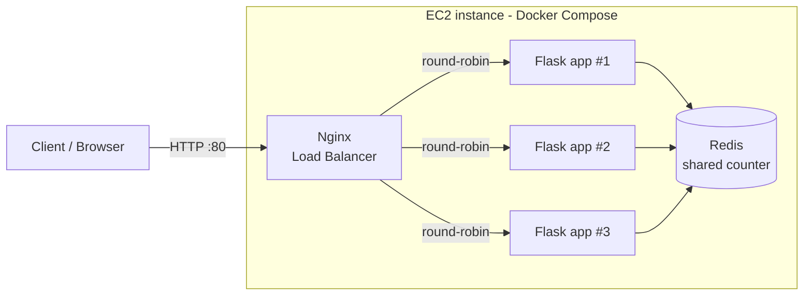

# Load-Balanced Flask Cluster with Shared Redis State

A small **distributed system**: 3 identical Flask containers run behind an **Nginx load balancer**, and all of them share one **Redis** instance for state. It is containerized with Docker, deployed on **AWS EC2**, and tested/deployed through **GitHub Actions**.

Every response says *which container* served it, so horizontal scaling and load distribution are easy to see.

## Architecture



CI/CD flow:

```
git push -> GitHub Actions (pytest -> docker build) -> [if green] SSH to EC2 -> docker compose up --build
```

| Component | Role |
|-----------|------|
| Nginx | Reverse proxy and load balancer (round-robin) |
| Flask + Gunicorn (x3) | Stateless API servers (horizontal scaling) |
| Redis | Shared state, so the hit counter is consistent across instances |
| Docker Compose | Runs all services and scales `app` replicas |
| GitHub Actions | Runs tests on every push/PR, deploys to EC2 |

## API

| Endpoint | Description |
|----------|-------------|
| `GET /` | Greeting, serving instance ID, global hit counter |
| `GET /health` | Health check |
| `GET /add/<a>/<b>` | Adds two numbers |
| `GET /stats` | Total hits and hits per instance (shows distribution) |

## Run locally

Requires Docker and Docker Compose.

```bash
git clone https://github.com/<your-username>/lb-cloud-project.git
cd lb-cloud-project
docker compose up -d --build --scale app=3
./scripts/demo.sh            # sends 12 requests, shows which container served each
```

Open http://localhost/ and refresh: the `instance` field changes between containers while `total_hits` keeps increasing (shared Redis). Stop with `docker compose down`.

## Run tests

```bash
pip install -r requirements-dev.txt
pytest -v
```

6 tests cover health, routing, arithmetic, the shared counter, per-instance stats and 404 handling (Redis is mocked with `fakeredis`).

## CI/CD and blocking bad code

- `.github/workflows/ci.yml` runs `pytest` and `docker build` on every push and pull request.
- `.github/workflows/deploy.yml` runs only after CI succeeds and redeploys to EC2 over SSH.
- Branch protection on `main` (Settings -> Branches): *Require a pull request* + *Require status checks to pass* (`test`). Failing tests means the merge is blocked.

## Deploy on AWS EC2

1. Launch an EC2 instance (Amazon Linux 2023, t3.micro). Security group: inbound **22** (SSH) and **80** (HTTP).
2. SSH in and install tools:
   ```bash
   sudo yum install -y docker git
   sudo systemctl enable --now docker
   sudo usermod -aG docker ec2-user
   sudo mkdir -p /usr/local/lib/docker/cli-plugins
   sudo curl -SL https://github.com/docker/compose/releases/latest/download/docker-compose-linux-x86_64 -o /usr/local/lib/docker/cli-plugins/docker-compose
   sudo chmod +x /usr/local/lib/docker/cli-plugins/docker-compose
   ```
   Log out and back in so the docker group applies.
3. Clone and start:
   ```bash
   git clone https://github.com/<your-username>/lb-cloud-project.git
   cd lb-cloud-project
   docker compose up -d --build --scale app=3
   ```
4. Visit `http://<EC2-PUBLIC-IP>/`, or run `./scripts/demo.sh http://<EC2-PUBLIC-IP>`.
5. For auto-deploy, add GitHub Secrets `EC2_HOST` (public IP) and `EC2_SSH_KEY` (private key contents).

## Screenshots
_Add: demo.sh output, green Actions run, blocked PR with failing test, EC2 console._
